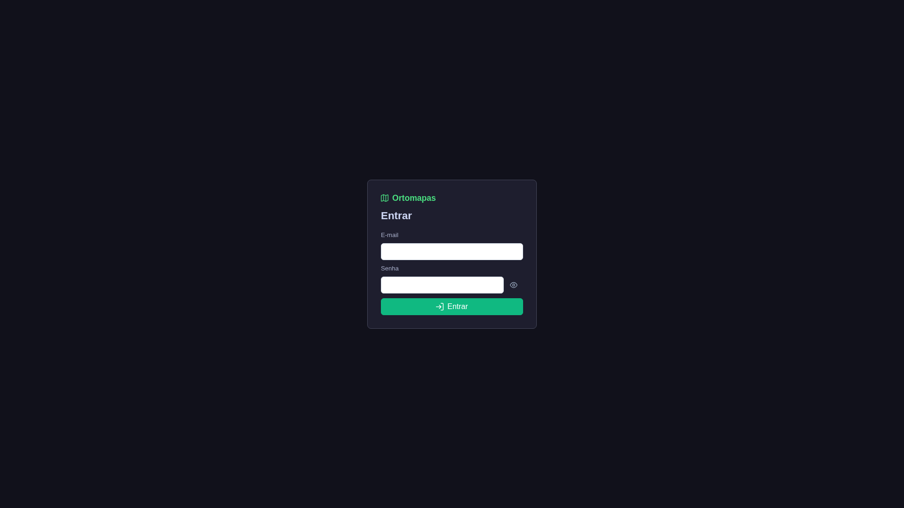
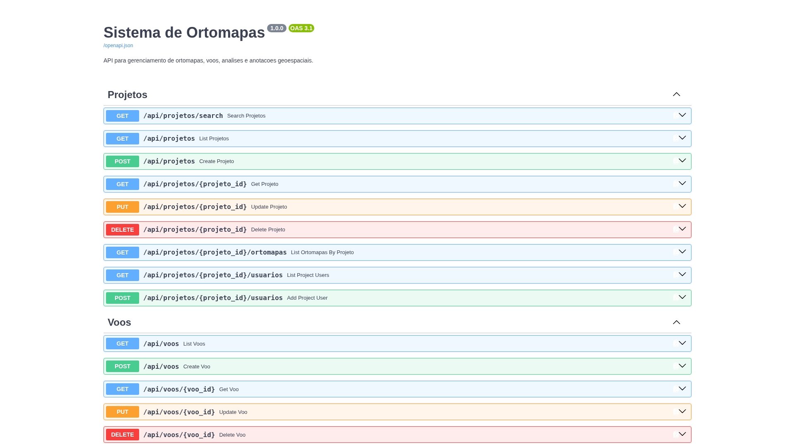
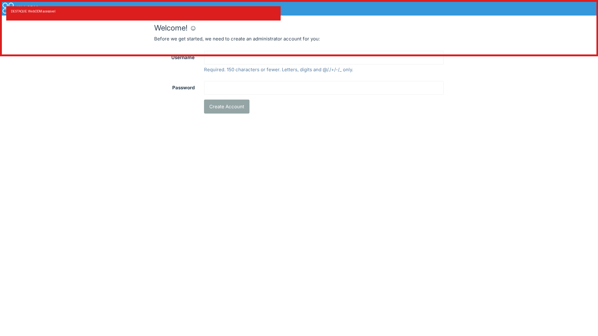
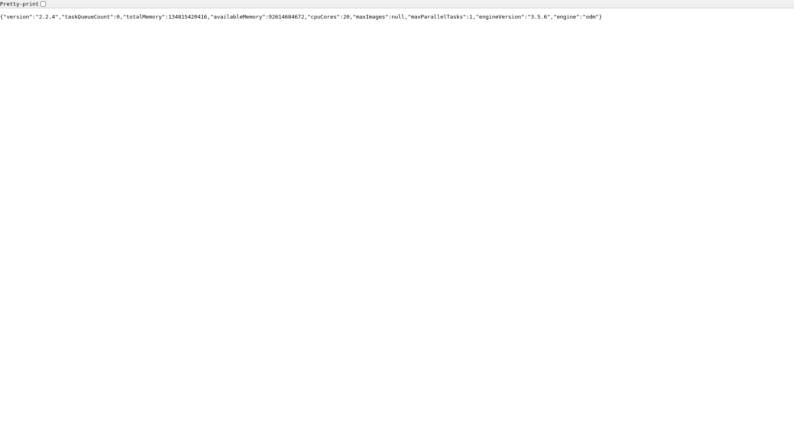
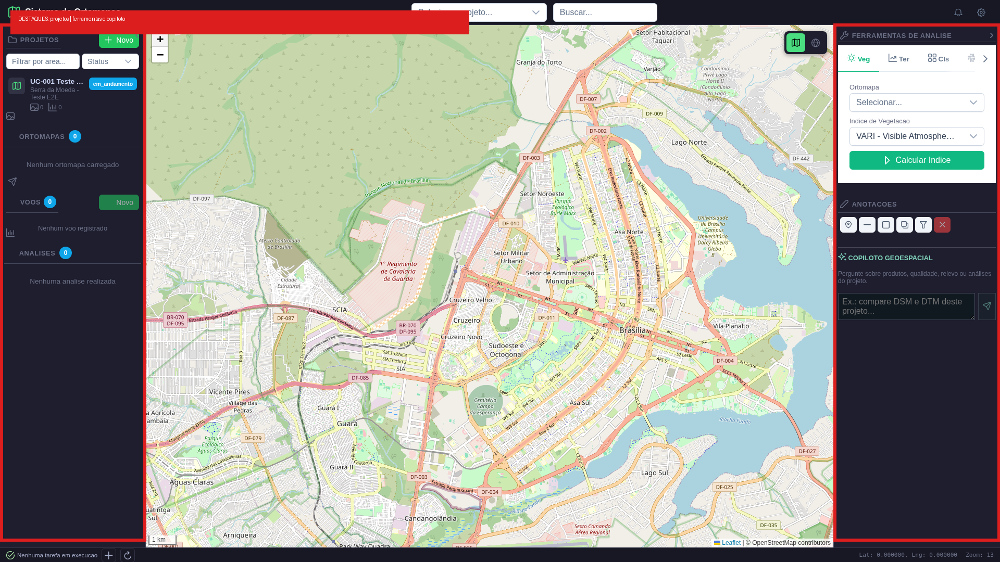
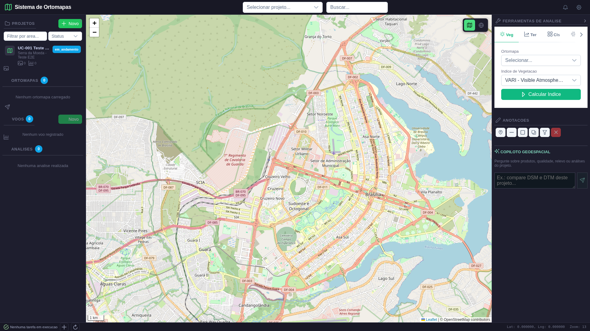
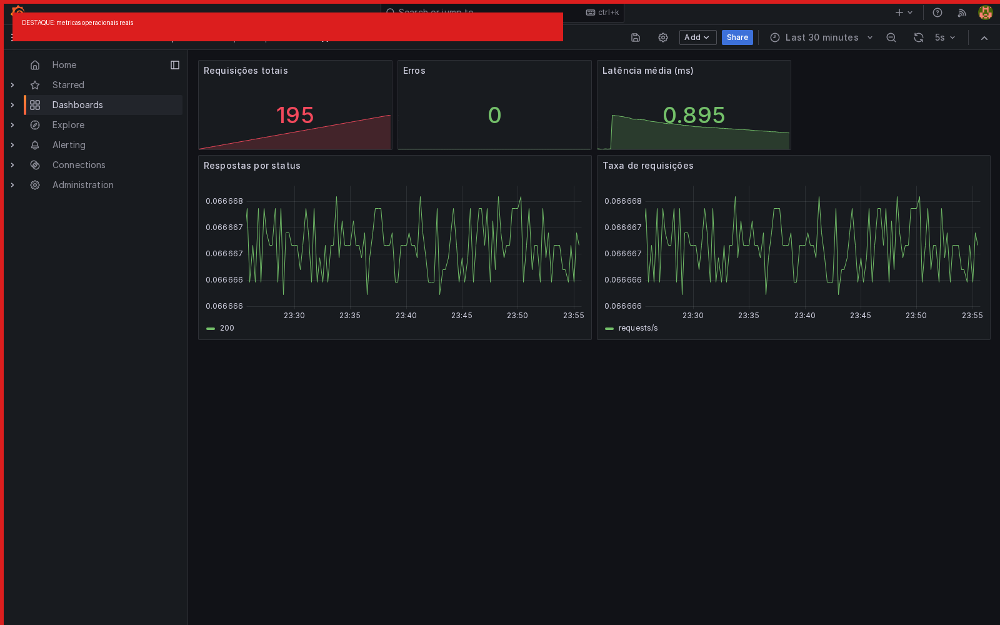

# Demonstracao operacional do Ortomapas

**Data:** 14/09/2026  | **Execucao:** Playwright Chromium + API real

## Objetivo

Este documento apresenta, como uma demonstracao para o cliente, o que esta pronto no sistema, quais telas foram observadas, quais dados foram processados e quais limites foram encontrados.

## Ambiente observado

| Componente | Endereco | Resultado |
|---|---|---|
| Frontend Vue/Leaflet | `http://localhost:5176` | carregado |
| Backend FastAPI | `http://localhost:8888` | `/health` HTTP 200, `healthy` |
| Swagger | `http://localhost:8888/docs` | carregado |
| WebODM | `http://localhost:8020` | pagina acessivel |
| NodeODM | `http://localhost:8021/info` | HTTP 200, engine ODM 3.5.6 |
| Prometheus/Grafana | `:9090` / `:3010` | metricas reais no dashboard |

*Figura 1 - Aplicacao aberta pelo Playwright.*

*Figura 2 - Contrato REST documentado no Swagger.*

*Figura 3 - WebODM acessivel para gerenciamento de tarefas.*

*Figura 4 - NodeODM respondendo com versao, engine e capacidade.*

## Fluxo demonstrado

### 1. Criacao e autenticacao de projeto

A suite E2E autenticada registrou um usuario efemero, obteve JWT, abriu a interface com o token e criou um novo projeto. O projeto recebeu ID persistido e foi recuperado por GET, confirmando a regra de isolamento por usuario.

**Resultado:** UC-001, UC-002 e UC-003 aprovados.

*Figura 5 - Tela completa: projetos, mapa, ferramentas, anotacoes e copiloto.*

### 2. Visualizacao cartografica

O mapa Leaflet foi carregado com tiles reais, controles de zoom e painel lateral. O Playwright executou zoom e verificou ausencia de erros JavaScript no console.

**Resultado:** UC-UI aprovado; mapa renderizado e interativo.

*Figura 6 - Mapa Leaflet validado visualmente.*

### 3. Analises espaciais

Foram executadas com GeoTIFFs reais existentes em `data/downloads` e `data/ortomapas`: estatisticas raster, VARI, TGI, ExG, GLI, declividade, aspecto, hillshade, curvas de nivel, deteccao de mudancas, KMeans, drenagem, volume e segmentacao.

| Funcao | Evidencia objetiva |
|---|---|
| Indices de vegetacao | VARI/TGI/ExG/GLI geraram GeoTIFFs validos |
| Terreno | slope, aspect e hillshade gerados |
| Hidrologia | rede de drenagem e acumulacao produzidas |
| Mudancas | 3,13% de pixels alterados no dataset E2E |
| Classificacao | 5 clusters, soma de proporcoes 100% |
| Volume | valores acima/abaixo de referencia nao-zero |
| Anotacoes | ponto e poligono persistidos |

**Resultado:** 17/17 casos de uso autenticados aprovados, 0 divergencias.

### 4. Ciclo ODM

O repositorio ja contem o conjunto de imagens Aukerman em `data/odm_test/aukerman.zip`, resultados em `aukerman-results.zip` e produtos importados em `data/ortomapas/` e `data/exports/`. O backend possui o fluxo REST: upload de imagens, criacao da tarefa NodeODM, consulta de progresso e importacao de ortomosaico, DSM, DTM, relatorio e nuvem de pontos.

Produtos reais encontrados:

- `odm_2_ortomosaico.tif` (aprox. 90 MB)
- `odm_2_dsm.tif` (aprox. 61 MB)
- `odm_2_dtm.tif` (aprox. 73 MB)
- `odm_2_nuvem_pontos.laz` e relatorio PDF

Durante esta demonstracao o NodeODM respondeu com fila vazia, indicando que nao havia processamento pendente; os produtos acima sao resultados persistidos de execucoes anteriores e foram usados nas validacoes do sistema.

### 5. Observabilidade

O dashboard Grafana foi validado com dados reais: 195 requisicoes, 0 erros e latencia media de 0,895 ms.

*Figura 7 - Dashboard operacional com dados reais.*

## Validacao automatizada

Execucao Playwright autenticada:

- **17/17 UCs aprovados (100%)**
- 0 divergencias
- Console JavaScript sem erros
- GeoTIFFs de saida com dimensoes e CRS validos

O relatorio detalhado por caso de uso esta em [relatorio_execucao.md](../relatorio_execucao.md).

## Analise critica e pontos de atencao

1. O roteiro legado `testevalidacao/test_ui_completo.py` apresentou falhas porque nao enviava JWT em endpoints protegidos; ele nao foi usado como criterio final. A suite autenticada atual corrigiu esse falso negativo.
2. A tela atual oferece o mapa e o painel de analises; a criacao de tarefas ODM esta exposta por API e pelo WebODM. Uma tela dedicada de upload e acompanhamento ODM ainda e uma melhoria de UX, nao uma falha do processamento.
3. Alertmanager esta pronto para alertas, mas o destino externo (e-mail, Slack ou webhook) depende das credenciais e do endpoint de producao.

## Conclusao para o cliente

O nucleo operacional esta funcional: autenticacao, projetos, visualizacao Leaflet, analises raster/terreno/hidrologia, anotacoes, produtos ODM persistidos e observabilidade foram demonstrados com dados reais. O sistema pode ser usado para validacao tecnica; as proximas entregas recomendadas sao a tela dedicada do ciclo ODM e a configuracao do canal externo de notificacoes.
