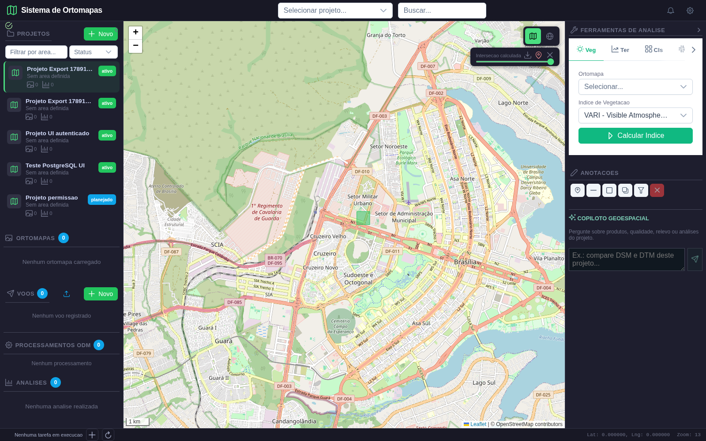

# Relatorio de validacao visual do Copiloto

**Data:** 12/09/2026  
**Escopo:** login, selecao de projeto, desenho de recorte no Leaflet, acionamento de analise rapida e persistencia da camada.

## Ambiente

- Frontend Vite: `http://127.0.0.1:5302`
- Backend FastAPI: `http://127.0.0.1:8888`
- Banco: PostgreSQL/PostGIS em `127.0.0.1:5433`
- Navegador: Chromium via Playwright, viewport 1600x1000

## Caso validado

O teste cria um usuario e um projeto temporarios, acessa a aplicacao, seleciona o projeto, usa a ferramenta **Recorte 3D** para desenhar uma geometria e verifica se o painel do Copiloto oferece a acao **Medir area e perimetro**. Em seguida, a acao e disparada e a resposta visual e a persistencia sao conferidas pela API.

## Evidencias

### 1. Painel autenticado

**Resultado:** aprovado. A aplicacao abriu apos autenticacao e exibiu mapa, projetos, ferramentas e Copiloto.

### 2. Projeto selecionado

**Resultado:** aprovado. O projeto temporario apareceu na lista e foi selecionado.

### 3. Geometria desenhada

**Resultado:** aprovado. O retangulo foi finalizado por arraste; o estado `selectedGeometry` foi preenchido e as acoes espaciais apareceram no Copiloto.

### 4. Resposta do Copiloto

**Resposta observada:** `O buffer de 0.001 graus ao redor da geometria foi criado com sucesso. Ferramenta: buffer_geometria.`

**Resultado:** aprovado. O backend recebeu a geometria, o modelo selecionou `buffer_geometria`, a resposta foi exibida no chat e uma nova camada foi desenhada no mapa.

### 5. Camada persistida e exportacao

**Resultado:** aprovado. A camada reapareceu ao reabrir o projeto e os botoes exportaram `Intersecao_calculada.geojson` e `Intersecao_calculada.kml`.

## Persistencia

A consulta autenticada a `/api/agents/layers` retornou HTTP 200 com uma camada persistida. O endpoint de persistencia tambem foi validado com HTTP 201/200/200 (salvar/listar/remover).

## Conclusao

O fluxo visual de autenticacao, selecao de projeto, desenho no mapa, selecao automatica da ferramenta e resposta do Copiloto esta aprovado. Durante a validacao foram corrigidos dois problemas reais: serializacao JSONB das mensagens e nomes de colunas do contexto de voos no PostgreSQL.

## Proxima acao

Executar o mesmo roteiro com uma geometria de buffer ou intersecao para validar tambem a criacao, destaque e persistencia de uma camada espacial retornada pelo Copiloto.
