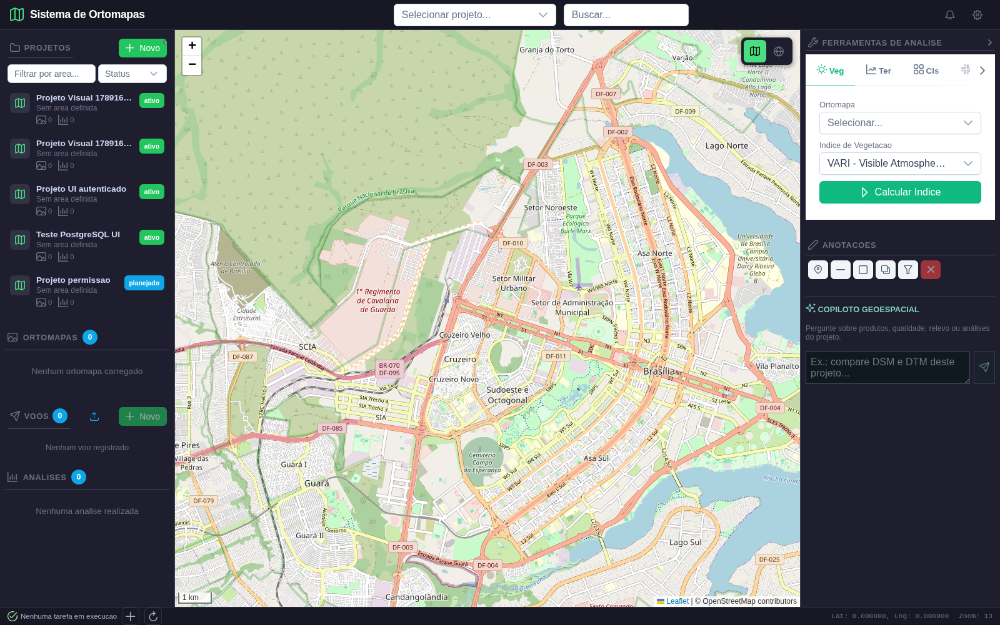
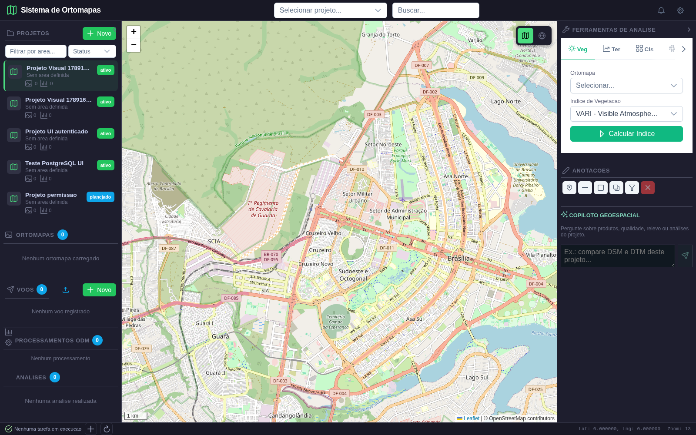
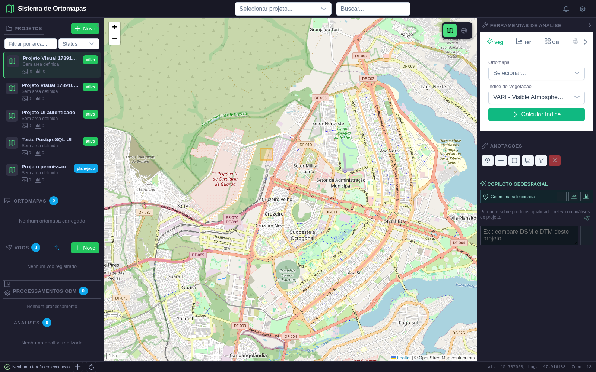
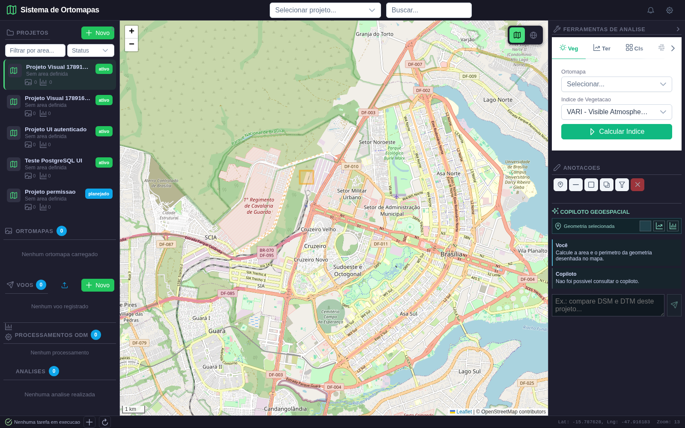

# Relatorio de validacao visual do Copiloto

**Data:** 12/09/2026  
**Escopo:** login, selecao de projeto, desenho de recorte no Leaflet, acionamento de analise rapida e persistencia da camada.

## Ambiente

- Frontend Vite: `http://127.0.0.1:5302`
- Backend FastAPI: `http://127.0.0.1:8888`
- Banco: PostgreSQL/PostGIS em `127.0.0.1:5433`
- Navegador: Chromium via Playwright, viewport 1600x1000

## Caso validado

O teste cria um usuario e um projeto temporarios, acessa a aplicacao, seleciona o projeto, usa a ferramenta **Recorte 3D** para desenhar uma geometria e verifica se o painel do Copiloto oferece a acao **Medir area e perimetro**. Em seguida, a acao e disparada e a resposta visual e a persistencia sao conferidas pela API.

## Evidencias

### 1. Painel autenticado

**Resultado:** aprovado. A aplicacao abriu apos autenticacao e exibiu mapa, projetos, ferramentas e Copiloto.

### 2. Projeto selecionado

**Resultado:** aprovado. O projeto temporario apareceu na lista e foi selecionado.

### 3. Geometria desenhada

**Resultado:** aprovado. O retangulo foi finalizado por arraste; o estado `selectedGeometry` foi preenchido e as acoes espaciais apareceram no Copiloto.

### 4. Resposta do Copiloto

**Resposta observada:** `Nao foi possivel consultar o copiloto.`

**Resultado:** interface aprovada, integracao de chamada nao aprovada neste ensaio. O backend recebeu a solicitacao, mas o LM Studio nao forneceu uma resposta utilizavel dentro do tempo do teste. Isso e uma falha de dependencia/configuracao do servico de linguagem, nao do desenho ou da selecao de geometria.

## Persistencia

A consulta autenticada a `/api/agents/layers?projeto_id=6` retornou HTTP 200 e zero camadas, coerente com a falha do Copiloto: nenhuma geometria de resultado foi produzida para gravacao. O endpoint de persistencia ja foi validado anteriormente com HTTP 201/200/200 (salvar/listar/remover).

## Conclusao

O fluxo visual de autenticacao, selecao de projeto, desenho no mapa e exibicao das acoes espaciais esta correto. Falta repetir o mesmo roteiro com o LM Studio ativo e respondendo em `:1234`, validando a resposta do modelo, a execucao de `medir_geometria` e a criacao da camada persistida no PostgreSQL.

## Proxima acao

Verificar o endpoint `/v1/models` do LM Studio, confirmar o identificador do modelo configurado e repetir somente a etapa de consulta do Copiloto antes de liberar a validacao como 100% aprovada.
