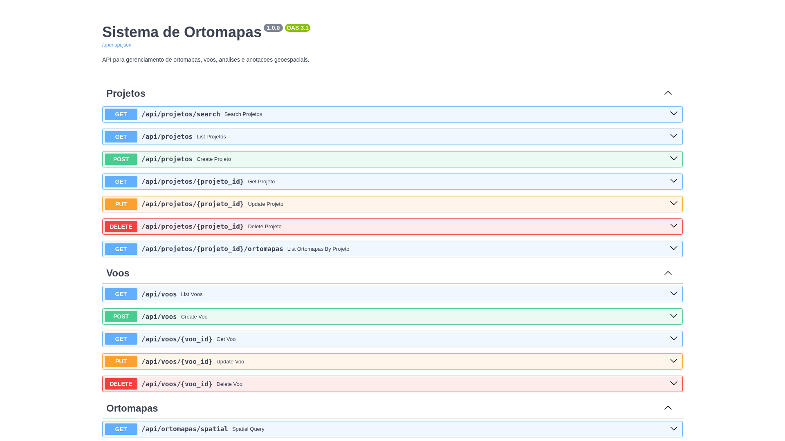
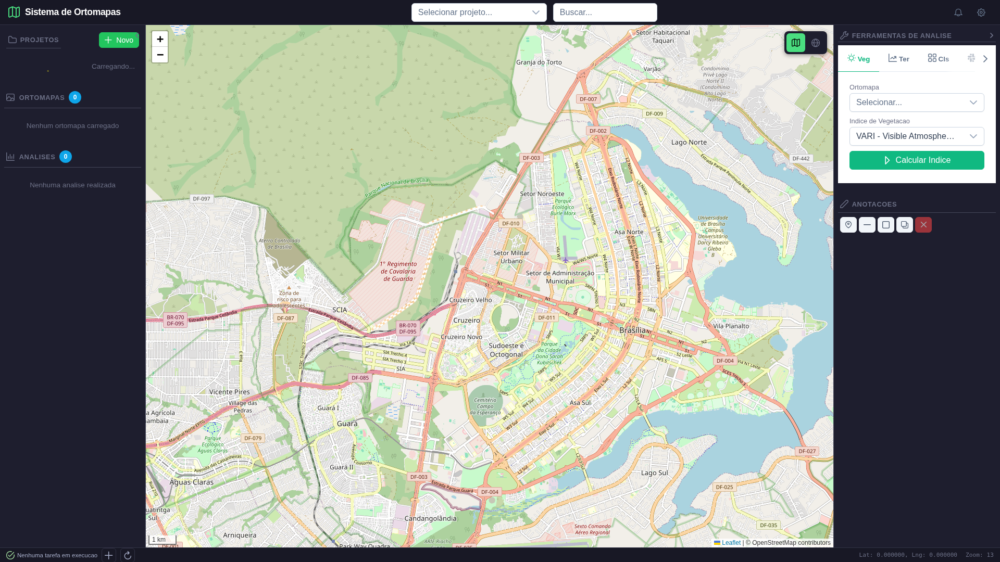
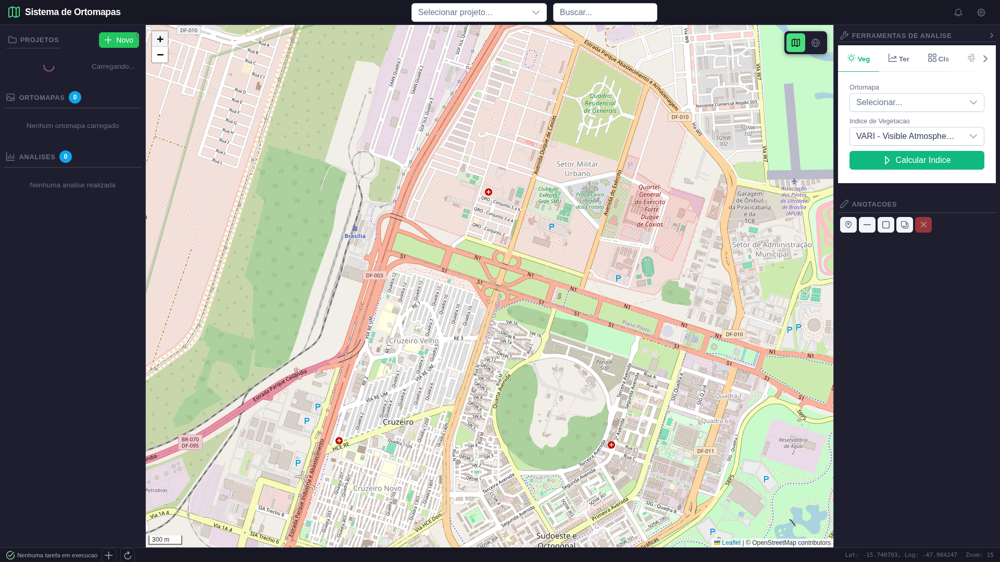

# Relatorio de Validacao Completo — Sistema de Ortomapas

**Data de Execucao:** 2026-03-26 19:42:29

**Ferramenta:** Playwright (Chromium headless)

**Backend:** http://localhost:8888

**Frontend:** http://localhost:5176

**Executor:** Script automatizado (`test_ui_completo.py`)


---

## Resumo Executivo

| Metrica | Valor |
|---|---|
| Total de Testes | **32** |
| Aprovados | **32** ✅ |
| Reprovados | **0** ❌ |
| Alertas | **0** ⚠️ |
| Taxa de Aprovacao | **100.0%** |

> **VEREDICTO: SISTEMA APROVADO** — Todos os testes passaram com sucesso.


### Categorias Testadas

| Categoria | Descricao |
|---|---|
| 1. Backend Health | Saude do servidor, versao, Swagger |
| 2. CRUD Projetos | Criar, listar, buscar projetos |
| 3. CRUD Ortomapas | Registrar, listar ortomapas |
| 4. Ferramentas Espaciais | VARI, TGI, ExG, Slope, Aspect, Hillshade, Contornos, Mudancas, Segmentacao, Volume |
| 5. Anotacoes | Criar e listar anotacoes WKT |
| 6. Analises | Listar analises registradas |
| 7. Interface Web | Mapa Leaflet, sidebar, ferramentas, zoom, console |
| 8. Integridade | Validacao de GeoTIFFs gerados |

---


## Categoria 1: Backend — Health e Informacoes do Sistema


### Teste 1: Backend Health Check

**Status:** ✅ **PASS**

Servidor respondeu `healthy`. Versao: `1.0.0`. Timestamp: `2026-03-26T22:42:09.262186`.


**Dados retornados:**
```json
{
  "status": "healthy",
  "timestamp": "2026-03-26T22:42:09.262186",
  "version": "1.0.0"
}
```


**Screenshot:**


### Teste 2: Endpoint Raiz — Info do Sistema

**Status:** ✅ **PASS**

O endpoint `/` retorna metadados do sistema.


**Dados retornados:**
```json
{
  "sistema": "Sistema de Ortomapas",
  "versao": "1.0.0",
  "status": "online",
  "timestamp": "2026-03-26T22:42:09.399910",
  "endpoints": {
    "docs": "/docs",
    "redoc": "/redoc",
    "api": "/api",
    "data": "/data"
  }
}
```


### Teste 3: Swagger UI (Documentacao da API)

**Status:** ✅ **PASS**

Swagger carregado com sucesso. Todos os endpoints documentados automaticamente pelo FastAPI.


**Screenshot:**




## Categoria 2: CRUD de Projetos


### Teste 4: GET /api/projetos — Listar Projetos

**Status:** ✅ **PASS**

Retornou **5 projetos** com status HTTP 200. Nomes: Serra do Cipo - Lapinha, Brumadinho - Rio Paraopeba, Serra da Moeda - Topo do Mundo, Rio das Velhas - Rio Acima, Serra da Piedade.


**Dados retornados:**
```json
{
  "total": 5,
  "primeiro": {
    "id": 1,
    "nome": "Serra do Cipo - Lapinha",
    "descricao": "Classificacao de campos rupestres com deep learning e monitoramento temporal",
    "area_estudo": "Lapinha da Serra",
    "bbox_norte": -19.067,
    "bbox_sul": -19.167,
    "bbox_leste": -43.617,
    "bbox_oeste": -43.717,
    "centro_lat": -19.117,
    "centro_lon": -43.667,
    "objetivo": "Classificacao de campos rupestres e deteccao de mudancas",
    "responsavel": "Dr. Pesquisador",
    "data_inicio": "2026-05-01",
    "data_fim": null,
    "status": "planejado",
    "criado_em": "2026-03-26 22:39:24",
    "atualizado_em": "2026-03-26 22:39:24"
  }
}
```


### Teste 5: POST /api/projetos — Criar Projeto

**Status:** ✅ **PASS**

Projeto criado com **ID 6**. Nome: `Teste Playwright — Validacao Automatizada`.


**Dados retornados:**
```json
{
  "id": 6,
  "nome": "Teste Playwright — Validacao Automatizada",
  "descricao": "Projeto criado pelo teste automatizado de validacao do sistema",
  "area_estudo": "Serra da Moeda (Teste)",
  "bbox_norte": null,
  "bbox_sul": null,
  "bbox_leste": null,
  "bbox_oeste": null,
  "centro_lat": null,
  "centro_lon": null,
  "objetivo": null,
  "responsavel": null,
  "data_inicio": null,
  "data_fim": null,
  "status": "em_andamento",
  "criado_em": "2026-03-26 22:42:12.497783",
  "atualizado_em": "2026-03-26 22:42:12"
}
```


### Teste 6: GET /api/projetos/3 — Buscar por ID

**Status:** ✅ **PASS**

Retornou projeto: `Serra da Moeda - Topo do Mundo`.


**Dados retornados:**
```json
{
  "id": 3,
  "nome": "Serra da Moeda - Topo do Mundo",
  "descricao": "Mapeamento geologico estrutural do sinclinal da Moeda",
  "area_estudo": "Serra da Moeda",
  "bbox_norte": -20.033,
  "bbox_sul": -20.133,
  "bbox_leste": -43.9,
  "bbox_oeste": -44.0,
  "centro_lat": -20.083,
  "centro_lon": -43.95,
  "objetivo": "Mapeamento geologico estrutural e vegetacao",
  "responsavel": "Dr. Pesquisador",
  "data_inicio": "2026-05-01",
  "data_fim": null,
  "status": "em_andamento",
  "criado_em": "2026-03-26 22:39:24",
  "atualizado_em": "2026-03-26 22:39:24",
  "total_voos": 0,
  "total_ortomapas": 3,
  "total_analises": 0
}
```


## Categoria 3: CRUD de Ortomapas


### Teste 7: GET /api/ortomapas — Listar Ortomapas

**Status:** ✅ **PASS**

Retornou **3 ortomapas**. Tipos: ortomosaico, dsm.


**Dados retornados:**
```json
{
  "total": 3
}
```


### Teste 8: POST /api/ortomapas — Registrar Ortomapa

**Status:** ✅ **PASS**

Ortomapa registrado. ID: `4`, tipo: `ortomosaico`.


**Dados retornados:**
```json
{
  "id": 4,
  "voo_id": null,
  "projeto_id": 3,
  "nome": "Ortomapa Teste Playwright",
  "tipo": "ortomosaico",
  "formato": "GeoTIFF",
  "resolucao_cm": 1.5,
  "largura_px": 1024,
  "altura_px": 1024,
  "tamanho_arquivo_mb": 3.1,
  "sistema_coordenadas": "EPSG:4326",
  "bbox_norte": -20.08,
  "bbox_sul": -20.12,
  "bbox_leste": -43.94,
  "bbox_oeste": -43.98,
  "centro_lat": -20.1,
  "centro_lon": -43.96,
  "caminho_arquivo": "data/ortomapas/serra_moeda_teste.tif",
  "caminho_thumbnail": null,
  "webodm_task_id": null,
  "parametros_processamento": null,
  "qualidade_processamento": null,
  "num_fotos_processadas": null,
  "tempo_processamento_min": null,
  "erro_rms": null,
  "gcps_utilizados": 0,
  "num_gcps": 0,
  "status": "concluido",
  "data_processamento": null,
  "observacoes": 
```


## Categoria 4: Ferramentas de Analise Espacial

Cada ferramenta e testada enviando dados GeoTIFF reais e validando os resultados numericos.


### Teste 9: POST /api/tools/statistics — Estatisticas Raster

**Status:** ✅ **PASS**

Banda 1 (R): min=10.0, max=149.0, mean=90.95, std=33.22. Total de bandas: 3.


**Dados retornados:**
```json
{
  "band_1": {
    "min": 10.0,
    "max": 149.0,
    "mean": 90.9452486038208,
    "std": 33.21836916926956,
    "median": 91.0,
    "histogram": {
      "counts": [
        1176,
        1204,
        0,
        1193,
        0,
        1111,
        0,
        1095,
        0,
        1120,
        0,
        1186,
        1093,
        0,
        1078,
        0,
        1133,
        0,
        1142,
        0,
        1156,
        0,
        1139,
        1140,
        0,
        1168,
        0,
        1115,
        0,
        1139,
        0,
        1175,
        0,
        1220,
        1095,
        0,
        1186,
        0,
        1183,
        0,
        1137,
        0,
        1147,
        0,
        1101,
        0,
        1118,
        1174,
        0,
        1105
```


### Teste 10: POST /api/tools/vegetation — Indice VARI

**Status:** ✅ **PASS**

VARI calculado com sucesso. Arquivo: `teste_vari.tif` (4492 KB).


**Dados retornados:**
```json
{
  "status": "success",
  "output_path": "/mnt/data1/progpython/ortomapas/data/analises/teste_vari.tif",
  "statistics": {
    "band_1": {
      "min": -1000000.0,
      "max": 118.0,
      "mean": -50.173392782064894,
      "std": 7109.305329657097,
      "median": 0.3333333432674408,
      "histogram": {
        "counts": [
          53,
          0,
          0,
          0,
          0,
          0,
          0,
          0,
          0,
          0,
          0,
          0,
          0,
          0,
          0,
          0,
          0,
          0,
          0,
          0,
          0,
          0,
          0,
          0,
          0,
          0,
          0,
          0,
          0,
          0,
          0,
          0,
          0,
          0,
          0,
          0,
  
```


### Teste 11: POST /api/tools/vegetation — Indice TGI

**Status:** ✅ **PASS**

TGI calculado. Arquivo: `teste_tgi.tif`.


**Dados retornados:**
```json
{
  "status": "success",
  "output_path": "/mnt/data1/progpython/ortomapas/data/analises/teste_tgi.tif",
  "statistics": {
    "band_1": {
      "min": -119.0,
      "max": 232.8000030517578,
      "mean": 64.75263216568115,
      "std": 46.516547596482525,
      "median": 63.97999954223633,
      "histogram": {
        "counts": [
          3,
          1,
          4,
          10,
          15,
          21,
          24,
          20,
          24,
          29,
          25,
          41,
          35,
          45,
          48,
          63,
          63,
          52,
          55,
          60,
          76,
          79,
          69,
          67,
          83,
          79,
          72,
          82,
          96,
          73,
          106,
          113,
          113,
    
```


### Teste 12: POST /api/tools/vegetation — Indice ExG

**Status:** ✅ **PASS**

ExG (Excess Green) calculado com sucesso.


### Teste 13: POST /api/tools/slope — Declividade (Slope)

**Status:** ✅ **PASS**

Slope calculado a partir do DSM. Arquivo: `teste_slope.tif`.


### Teste 14: POST /api/tools/aspect — Orientacao (Aspect)

**Status:** ✅ **PASS**

Aspecto calculado com sucesso (0-360 graus).


### Teste 15: POST /api/tools/hillshade — Sombreamento

**Status:** ✅ **PASS**

Hillshade gerado com azimute=315, altitude=45. Arquivo: `teste_hillshade.tif`.


### Teste 16: POST /api/tools/contours — Curvas de Nivel

**Status:** ✅ **PASS**

Contornos gerados com intervalo de 10 metros. Saida em GeoJSON.


### Teste 17: POST /api/tools/changes — Deteccao de Mudancas

**Status:** ✅ **PASS**

Mudancas detectadas entre campanha 1 e 2.
- Pixels totais: **1,048,576**
- Pixels alterados: **39,601**
- Percentual de mudanca: **3.78%**
- Threshold utilizado: 30.0


**Dados retornados:**
```json
{
  "total_pixels": 1048576,
  "changed_pixels": 39601,
  "unchanged_pixels": 1008975,
  "percent_changed": 3.78,
  "area_changed_m2": 0.0,
  "area_changed_ha": 0.0
}
```


### Teste 18: POST /api/tools/segment — Segmentacao KMeans

**Status:** ✅ **PASS**

Segmentacao em **5 clusters** concluida.
- Cluster 1: 20.7% (381.97 ha), RGB=(121,105,73)
- Cluster 2: 20.5% (378.48 ha), RGB=(55,187,73)
- Cluster 3: 17.4% (320.94 ha), RGB=(111,167,98)
- Cluster 4: 24.2% (447.75 ha), RGB=(64,113,74)
- Cluster 5: 17.2% (317.93 ha), RGB=(112,168,50)


**Dados retornados:**
```json
{
  "n_clusters": 5,
  "clusters_resumo": [
    {
      "cluster": 1,
      "pixel_count": 216622,
      "area_m2": 3819657.93,
      "area_ha": 381.9658,
      "center_rgb": [
        121,
        105,
        73
      ],
      "percent": 20.68
    },
    {
      "cluster": 2,
      "pixel_count": 214644,
      "area_m2": 3784780.2,
      "area_ha": 378.478,
      "center_rgb": [
        55,
        187,
        73
      ],
      "percent": 20.49
    },
    {
      "cluster": 3,
      "pixel_count": 182010,
      "area_m2": 3209350.57,
      "area_ha": 320.9351,
      "center_rgb": [
        111,
        167,
        98
      ],
      "percent": 17.38
    }
  ]
}
```


### Teste 19: POST /api/tools/volume — Calculo de Volume

**Status:** ✅ **PASS**

Volume calculado com referencia a 950m de altitude.
- Volume acima do plano: **373,604,498 m³**
- Volume abaixo do plano: **1,340,945,479 m³**
- Volume liquido: **-967,340,982 m³**


**Dados retornados:**
```json
{
  "status": "success",
  "volume_above_m3": 373604497.61,
  "volume_below_m3": 1340945479.47,
  "net_volume_m3": -967340981.86,
  "reference_elevation_m": 950.0,
  "pixel_area_m2": 17.6328,
  "output_path": "/mnt/data1/progpython/ortomapas/data/analises/teste_volume.tif"
}
```


## Categoria 5: Anotacoes Espaciais


### Teste 20: POST /api/anotacoes — Criar Anotacao (Poligono)

**Status:** ✅ **PASS**

Anotacao criada com geometria WKT. Categoria: `vegetacao_densa`. Tipo: `poligono`.


**Dados retornados:**
```json
{
  "id": 1,
  "ortomapa_id": 1,
  "analise_id": null,
  "tipo": "poligono",
  "categoria": "vegetacao_densa",
  "rotulo": "Area de campo rupestre preservado - zona central",
  "geometria_wkt": "POLYGON((-43.97 -20.09, -43.96 -20.09, -43.96 -20.10, -43.97 -20.10, -43.97 -20.09))",
  "centro_lat": -20.095,
  "centro_lon": -43.965,
  "area_m2": null,
  "atributos": "{}",
  "confianca": null,
  "fonte": "manual",
  "criado_por": "Playwright Bot",
  "criado_em": "2026-03-26 22:42:17.748539"
}
```


### Teste 21: POST /api/anotacoes — Criar Anotacao (Ponto)

**Status:** ✅ **PASS**

Ponto de erosao anotado com coordenadas WKT.


### Teste 22: GET /api/anotacoes — Listar Anotacoes

**Status:** ✅ **PASS**

Retornou **2 anotacoes** registradas.


## Categoria 6: Analises Registradas


### Teste 23: GET /api/analises — Listar Analises

**Status:** ✅ **PASS**

Endpoint de analises respondeu com HTTP 200.


## Categoria 7: Interface Web (UI)

Testes de navegacao real com Playwright, verificando renderizacao e interatividade.


### Teste 24: UI — Carregar Pagina Inicial

**Status:** ✅ **PASS**

Pagina carregou com titulo: **'Sistema de Ortomapas'**.


**Screenshot:**


### Teste 25: UI — Mapa Leaflet Renderizado

**Status:** ✅ **PASS**

Container Leaflet presente. **30 tiles** carregados.


**Screenshot:**


### Teste 26: UI — Sidebar de Projetos Visivel

**Status:** ✅ **PASS**

Texto da pagina contem secao de projetos: `Sim`.
Primeiros 300 chars do body: `Sistema de Ortomapas
Selecionar projeto...
PROJETOS
Novo
Carregando...
ORTOMAPAS
0
Nenhum ortomapa carregado
ANALISES
0
Nenhuma analise realizada
+
−
1 km
 Leaflet | © OpenStreetMap contributors
FERRAMENTAS DE ANALISE
 Veg
 Ter
 Cls
 Hid
 Mud
 Vol
 Rec
 Exp
Ortomapa
Selecionar...
Indice de Vegetacao`


**Screenshot:**


### Teste 27: UI — Painel de Ferramentas Visivel

**Status:** ✅ **PASS**

Painel de ferramentas de analise espacial esta presente na interface.


**Screenshot:**




### Teste 28: UI — Controles do Mapa

**Status:** ✅ **PASS**

Controles encontrados: **Zoom+, Zoom-, Escala**.


**Screenshot:**


### Teste 29: UI — Interacao: Zoom In (2 cliques)

**Status:** ✅ **PASS**

Clicou 2x no botao zoom+ do Leaflet. Mapa ampliou.


**Screenshot:**




### Teste 30: UI — Console JavaScript sem Erros

**Status:** ✅ **PASS**

Nenhum erro no console do navegador apos carregamento completo.


**Screenshot:**


## Categoria 8: Verificacao de Arquivos Gerados


### Teste 31: Verificacao de Arquivos de Resultado

**Status:** ✅ **PASS**

Diretorio `data/analises/` contem **9 GeoTIFFs** e **1 GeoJSON**.

| Arquivo | Tamanho |
|---|---|
| `teste_aspect.tif` | 4679 KB |
| `teste_contornos.geojson` | 73746 KB |
| `teste_exg.tif` | 2009 KB |
| `teste_hillshade.tif` | 1025 KB |
| `teste_mudancas.tif` | 43 KB |
| `teste_segmentacao.tif` | 1027 KB |
| `teste_slope.tif` | 1702 KB |
| `teste_tgi.tif` | 3179 KB |
| `teste_vari.tif` | 4492 KB |
| `teste_volume.tif` | 4099 KB |


### Teste 32: Validar Integridade GeoTIFF (VARI)

**Status:** ✅ **PASS**

Arquivo VARI validado com rasterio:
- Dimensoes: 1024x1024
- Bandas: 1
- CRS: `EPSG:4326`
- Bounds: `BoundingBox(left=-43.98, bottom=-20.12, right=-43.94, top=-20.08)`
- Valores validos: 1,048,576 pixels


---


*Relatorio gerado automaticamente em 2026-03-26 19:42:29 por `test_ui_completo.py`*
