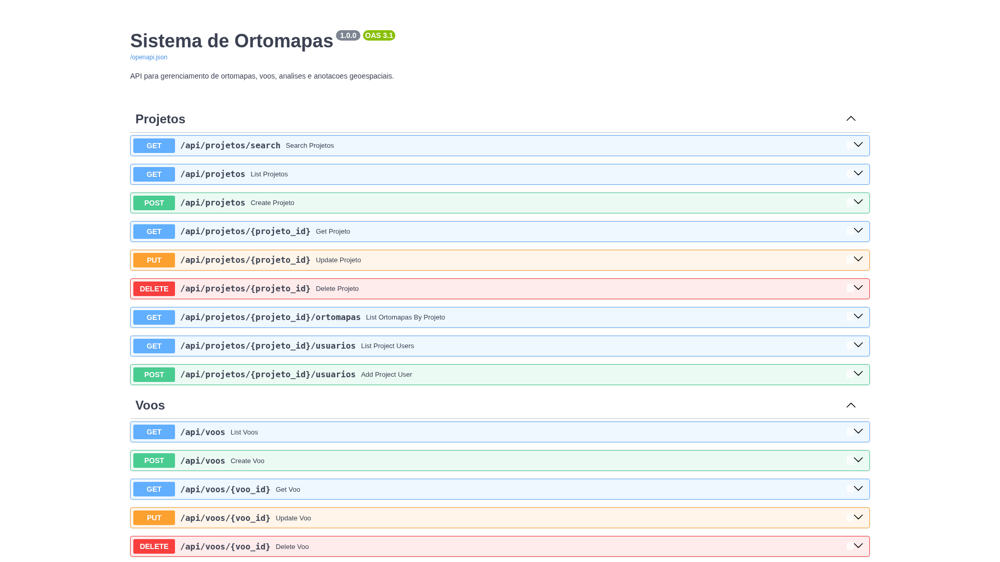
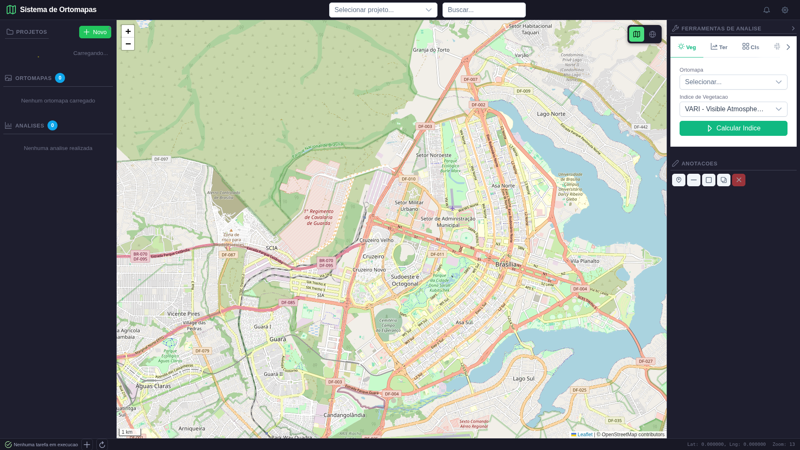

# Relatorio de Validacao Completo — Sistema de Ortomapas

**Data de Execucao:** 2026-09-14 13:28:55

**Ferramenta:** Playwright (Chromium headless)

**Backend:** http://localhost:8888

**Frontend:** http://localhost:5176

**Executor:** Script automatizado (`test_ui_completo.py`)


---

## Resumo Executivo

| Metrica | Valor |
|---|---|
| Total de Testes | **32** |
| Aprovados | **23** ✅ |
| Reprovados | **5** ❌ |
| Alertas | **4** ⚠️ |
| Taxa de Aprovacao | **71.9%** |

> **VEREDICTO: 5 FALHA(S) DETECTADA(S)** — Correcoes necessarias.


### Categorias Testadas

| Categoria | Descricao |
|---|---|
| 1. Backend Health | Saude do servidor, versao, Swagger |
| 2. CRUD Projetos | Criar, listar, buscar projetos |
| 3. CRUD Ortomapas | Registrar, listar ortomapas |
| 4. Ferramentas Espaciais | VARI, TGI, ExG, Slope, Aspect, Hillshade, Contornos, Mudancas, Segmentacao, Volume |
| 5. Anotacoes | Criar e listar anotacoes WKT |
| 6. Analises | Listar analises registradas |
| 7. Interface Web | Mapa Leaflet, sidebar, ferramentas, zoom, console |
| 8. Integridade | Validacao de GeoTIFFs gerados |

---


## Categoria 1: Backend — Health e Informacoes do Sistema


### Teste 1: Backend Health Check

**Status:** ✅ **PASS**

Servidor respondeu `healthy`. Versao: `1.0.0`. Timestamp: `2026-09-14T16:28:39.808387`.


**Dados retornados:**
```json
{
  "status": "healthy",
  "timestamp": "2026-09-14T16:28:39.808387",
  "version": "1.0.0"
}
```


**Screenshot:**


### Teste 2: Endpoint Raiz — Info do Sistema

**Status:** ✅ **PASS**

O endpoint `/` retorna metadados do sistema.


**Dados retornados:**
```json
{
  "sistema": "Sistema de Ortomapas",
  "versao": "1.0.0",
  "status": "online",
  "timestamp": "2026-09-14T16:28:40.000573",
  "endpoints": {
    "docs": "/docs",
    "redoc": "/redoc",
    "api": "/api",
    "data": "/data"
  }
}
```


### Teste 3: Swagger UI (Documentacao da API)

**Status:** ✅ **PASS**

Swagger carregado com sucesso. Todos os endpoints documentados automaticamente pelo FastAPI.


**Screenshot:**




## Categoria 2: CRUD de Projetos


### Teste 4: GET /api/projetos — Listar Projetos

**Status:** ❌ **FAIL**


**Erro encontrado:**
```
Traceback (most recent call last):
  File "/mnt/data1/progpython/ortomapas/testevalidacao/test_ui_completo.py", line 127, in run_all
    assert r.status == 200
           ^^^^^^^^^^^^^^^
AssertionError

```


### Teste 5: POST /api/projetos — Criar Projeto

**Status:** ❌ **FAIL**


**Erro encontrado:**
```
Traceback (most recent call last):
  File "/mnt/data1/progpython/ortomapas/testevalidacao/test_ui_completo.py", line 148, in run_all
    assert r.status in (200, 201), f"HTTP {r.status}: {r.text()}"
           ^^^^^^^^^^^^^^^^^^^^^^
AssertionError: HTTP 401: {"detail":"Autenticacao necessaria"}

```


### Teste 6: GET /api/projetos/3 — Buscar por ID

**Status:** ❌ **FAIL**


**Erro encontrado:**
```
Traceback (most recent call last):
  File "/mnt/data1/progpython/ortomapas/testevalidacao/test_ui_completo.py", line 160, in run_all
    assert r.status == 200
           ^^^^^^^^^^^^^^^
AssertionError

```


## Categoria 3: CRUD de Ortomapas


### Teste 7: GET /api/ortomapas — Listar Ortomapas

**Status:** ✅ **PASS**

Retornou **4 ortomapas**. Tipos: dsm, dtm, ortomosaico.


**Dados retornados:**
```json
{
  "total": 4
}
```


### Teste 8: POST /api/ortomapas — Registrar Ortomapa

**Status:** ❌ **FAIL**


**Erro encontrado:**
```
Traceback (most recent call last):
  File "/mnt/data1/progpython/ortomapas/testevalidacao/test_ui_completo.py", line 197, in run_all
    assert r.status in (200, 201), f"HTTP {r.status}"
           ^^^^^^^^^^^^^^^^^^^^^^
AssertionError: HTTP 500

```


## Categoria 4: Ferramentas de Analise Espacial

Cada ferramenta e testada enviando dados GeoTIFF reais e validando os resultados numericos.


### Teste 9: POST /api/tools/statistics — Estatisticas Raster

**Status:** ✅ **PASS**

Banda 1 (R): min=10.0, max=189.0, mean=92.46, std=34.14. Total de bandas: 3.


**Dados retornados:**
```json
{
  "band_1": {
    "min": 10.0,
    "max": 189.0,
    "mean": 92.45590686798096,
    "std": 34.14333333607057,
    "median": 92.0,
    "histogram": {
      "counts": [
        1152,
        1174,
        1162,
        0,
        1086,
        1071,
        0,
        1096,
        1160,
        0,
        1069,
        1050,
        1111,
        0,
        1123,
        1125,
        0,
        1107,
        1102,
        0,
        1135,
        1085,
        1119,
        0,
        1155,
        1195,
        0,
        1064,
        1158,
        0,
        1161,
        1103,
        1113,
        0,
        1073,
        1089,
        0,
        1144,
        1081,
        0,
        1123,
        1102,
        9116,
        0,
        9207,
        9191,
        0,
        9043,
 
```


### Teste 10: POST /api/tools/vegetation — Indice VARI

**Status:** ✅ **PASS**

VARI calculado com sucesso. Arquivo: `teste_vari.tif` (4511 KB).


**Dados retornados:**
```json
{
  "status": "success",
  "output_path": "/mnt/data1/progpython/ortomapas/data/analises/teste_vari.tif",
  "statistics": {
    "band_1": {
      "min": -1000000.0,
      "max": 118.0,
      "mean": -75.96686188666595,
      "std": 8734.310262441195,
      "median": 0.31506848335266113,
      "histogram": {
        "counts": [
          80,
          0,
          0,
          0,
          0,
          0,
          0,
          0,
          0,
          0,
          0,
          0,
          0,
          0,
          0,
          0,
          0,
          0,
          0,
          0,
          0,
          0,
          0,
          0,
          0,
          0,
          0,
          0,
          0,
          0,
          0,
          0,
          0,
          0,
          0,
          0,
  
```


### Teste 11: POST /api/tools/vegetation — Indice TGI

**Status:** ✅ **PASS**

TGI calculado. Arquivo: `teste_tgi.tif`.


**Dados retornados:**
```json
{
  "status": "success",
  "output_path": "/mnt/data1/progpython/ortomapas/data/analises/teste_tgi.tif",
  "statistics": {
    "band_1": {
      "min": -142.91000366210938,
      "max": 232.8000030517578,
      "mean": 61.16339914873495,
      "std": 50.10847698605513,
      "median": 61.650001525878906,
      "histogram": {
        "counts": [
          5,
          4,
          12,
          7,
          2,
          15,
          18,
          27,
          38,
          40,
          29,
          38,
          55,
          54,
          64,
          65,
          69,
          103,
          108,
          117,
          120,
          131,
          180,
          148,
          204,
          211,
          197,
          220,
          243,
          244,
          265,
         
```


### Teste 12: POST /api/tools/vegetation — Indice ExG

**Status:** ✅ **PASS**

ExG (Excess Green) calculado com sucesso.


### Teste 13: POST /api/tools/slope — Declividade (Slope)

**Status:** ✅ **PASS**

Slope calculado a partir do DSM. Arquivo: `teste_slope.tif`.


### Teste 14: POST /api/tools/aspect — Orientacao (Aspect)

**Status:** ✅ **PASS**

Aspecto calculado com sucesso (0-360 graus).


### Teste 15: POST /api/tools/hillshade — Sombreamento

**Status:** ✅ **PASS**

Hillshade gerado com azimute=315, altitude=45. Arquivo: `teste_hillshade.tif`.


### Teste 16: POST /api/tools/contours — Curvas de Nivel

**Status:** ✅ **PASS**

Contornos gerados com intervalo de 10 metros. Saida em GeoJSON.


### Teste 17: POST /api/tools/changes — Deteccao de Mudancas

**Status:** ✅ **PASS**

Mudancas detectadas entre campanha 1 e 2.
- Pixels totais: **1,048,576**
- Pixels alterados: **32,787**
- Percentual de mudanca: **3.13%**
- Threshold utilizado: 30.0


**Dados retornados:**
```json
{
  "total_pixels": 1048576,
  "changed_pixels": 32787,
  "unchanged_pixels": 1015789,
  "percent_changed": 3.13,
  "area_changed_m2": 0.0,
  "area_changed_ha": 0.0
}
```


### Teste 18: POST /api/tools/segment — Segmentacao KMeans

**Status:** ✅ **PASS**

Segmentacao em **5 clusters** concluida.
- Cluster 1: 20.6% (379.79 ha), RGB=(56,187,73)
- Cluster 2: 20.2% (373.36 ha), RGB=(124,94,74)
- Cluster 3: 17.4% (321.79 ha), RGB=(113,165,50)
- Cluster 4: 17.4% (321.07 ha), RGB=(113,165,98)
- Cluster 5: 24.4% (450.53 ha), RGB=(65,113,74)


**Dados retornados:**
```json
{
  "n_clusters": 5,
  "clusters_resumo": [
    {
      "cluster": 1,
      "pixel_count": 215387,
      "area_m2": 3797881.39,
      "area_ha": 379.7881,
      "center_rgb": [
        56,
        187,
        73
      ],
      "percent": 20.57
    },
    {
      "cluster": 2,
      "pixel_count": 211744,
      "area_m2": 3733645.0,
      "area_ha": 373.3645,
      "center_rgb": [
        124,
        94,
        74
      ],
      "percent": 20.22
    },
    {
      "cluster": 3,
      "pixel_count": 182493,
      "area_m2": 3217867.22,
      "area_ha": 321.7867,
      "center_rgb": [
        113,
        165,
        50
      ],
      "percent": 17.43
    }
  ]
}
```


### Teste 19: POST /api/tools/volume — Calculo de Volume

**Status:** ✅ **PASS**

Volume calculado com referencia a 950m de altitude.
- Volume acima do plano: **373,604,498 m³**
- Volume abaixo do plano: **1,340,945,479 m³**
- Volume liquido: **-967,340,982 m³**


**Dados retornados:**
```json
{
  "status": "success",
  "volume_above_m3": 373604497.61,
  "volume_below_m3": 1340945479.47,
  "net_volume_m3": -967340981.86,
  "reference_elevation_m": 950.0,
  "pixel_area_m2": 17.6328,
  "output_path": "/mnt/data1/progpython/ortomapas/data/analises/teste_volume.tif"
}
```


## Categoria 5: Anotacoes Espaciais


### Teste 20: POST /api/anotacoes — Criar Anotacao (Poligono)

**Status:** ✅ **PASS**

Anotacao criada com geometria WKT. Categoria: `vegetacao_densa`. Tipo: `poligono`.


### Teste 21: POST /api/anotacoes — Criar Anotacao (Ponto)

**Status:** ✅ **PASS**

Ponto de erosao anotado com coordenadas WKT.


### Teste 22: GET /api/anotacoes — Listar Anotacoes

**Status:** ✅ **PASS**

Retornou **18 anotacoes** registradas.


## Categoria 6: Analises Registradas


### Teste 23: GET /api/analises — Listar Analises

**Status:** ✅ **PASS**

Endpoint de analises respondeu com HTTP 200.


## Categoria 7: Interface Web (UI)

Testes de navegacao real com Playwright, verificando renderizacao e interatividade.


### Teste 24: UI — Carregar Pagina Inicial

**Status:** ✅ **PASS**

Pagina carregou com titulo: **'Sistema de Ortomapas'**.


**Screenshot:**


### Teste 25: UI — Mapa Leaflet Renderizado

**Status:** ❌ **FAIL**


**Erro encontrado:**
```
Container Leaflet nao encontrado
```


**Screenshot:**


### Teste 26: UI — Sidebar de Projetos Visivel

**Status:** ⚠️ **WARN**

Texto da pagina contem secao de projetos: `Nao`.
Primeiros 300 chars do body: `Ortomapas
Entrar
E-mail
Senha
Enter a password
Entrar`


**Screenshot:**


### Teste 27: UI — Painel de Ferramentas Visivel

**Status:** ⚠️ **WARN**

Painel de ferramentas de analise espacial esta presente na interface.


**Screenshot:**




### Teste 28: UI — Controles do Mapa

**Status:** ⚠️ **WARN**

Controles encontrados: ****.


**Screenshot:**


### Teste 29: UI — Interacao: Zoom In

**Status:** ⚠️ **WARN**

Botao zoom+ nao encontrado.


### Teste 30: UI — Console JavaScript sem Erros

**Status:** ✅ **PASS**

Nenhum erro no console do navegador apos carregamento completo.


**Screenshot:**


## Categoria 8: Verificacao de Arquivos Gerados


### Teste 31: Verificacao de Arquivos de Resultado

**Status:** ✅ **PASS**

Diretorio `data/analises/` contem **145 GeoTIFFs** e **23 GeoJSON**.

| Arquivo | Tamanho |
|---|---|
| `classified_kmeans.tif` | 2801 KB |
| `debug_mudancas.tif` | 41 KB |
| `e2e_aspect.tif` | 4679 KB |
| `e2e_changes.tif` | 304 KB |
| `e2e_classificacao.tif` | 1027 KB |
| `e2e_contornos.geojson` | 73746 KB |
| `e2e_contours.geojson` | 31806 KB |
| `e2e_drenagem.geojson` | 3273 KB |
| `e2e_drenagem_filled.tif` | 1050 KB |
| `e2e_drenagem_flowacc.tif` | 283 KB |
| `e2e_drenagem_flowdir.tif` | 137 KB |
| `e2e_drenagem_resampled.tif` | 1026 KB |
| `e2e_exg.tif` | 2025 KB |
| `e2e_gli.tif` | 4614 KB |
| `e2e_hillshade.tif` | 1025 KB |
| `e2e_mudancas.tif` | 48 KB |
| `e2e_segmentacao.tif` | 1027 KB |
| `e2e_slope.tif` | 1702 KB |
| `e2e_streams.geojson` | 137542 KB |
| `e2e_streams_filled.tif` | 87812 KB |
| `e2e_streams_flowacc.tif` | 37546 KB |
| `e2e_streams_flowdir.tif` | 9338 KB |
| `e2e_tgi.tif` | 3195 KB |
| `e2e_vari.tif` | 4511 KB |
| `e2e_volume.tif` | 4099 KB |
| `err_negative.geojson` | 0 KB |
| `err_negative_filled.tif` | 610 KB |
| `err_negative_flowacc.tif` | 133 KB |
| `err_negative_flowdir.tif` | 67 KB |
| `err_negative_resampled.tif` | 498 KB |
| `err_zero.geojson` | 0 KB |
| `err_zero_filled.tif` | 610 KB |
| `err_zero_flowacc.tif` | 133 KB |
| `err_zero_flowdir.tif` | 67 KB |
| `err_zero_resampled.tif` | 498 KB |
| `manual_derna_vari.tif` | 15154 KB |
| `manual_slope.tif` | 6805 KB |
| `multi_dem_90m_aspect.tif` | 41714 KB |
| `multi_dem_90m_contours.geojson` | 235220 KB |
| `multi_dem_90m_hillshade.tif` | 12997 KB |
| `multi_dem_90m_seg7.tif` | 292 KB |
| `multi_dem_90m_segment.tif` | 207 KB |
| `multi_dem_90m_slope.tif` | 42980 KB |
| `multi_dem_90m_volume.tif` | 13332 KB |
| `multi_dem_small_aspect.tif` | 6684 KB |
| `multi_dem_small_contours.geojson` | 9352 KB |
| `multi_dem_small_hillshade.tif` | 4992 KB |
| `multi_dem_small_seg7.tif` | 44 KB |
| `multi_dem_small_segment.tif` | 38 KB |
| `multi_dem_small_slope.tif` | 6805 KB |
| `multi_dem_small_streams.geojson` | 5880 KB |
| `multi_dem_small_streams_filled.tif` | 5885 KB |
| `multi_dem_small_streams_flowacc.tif` | 1299 KB |
| `multi_dem_small_streams_flowdir.tif` | 522 KB |
| `multi_dem_small_volume.tif` | 3839 KB |
| `multi_derna_aspect.tif` | 6684 KB |
| `multi_derna_contours.geojson` | 9352 KB |
| `multi_derna_exg.tif` | 4363 KB |
| `multi_derna_gli.tif` | 16547 KB |
| `multi_derna_hillshade.tif` | 4992 KB |
| `multi_derna_seg7.tif` | 3963 KB |
| `multi_derna_segment.tif` | 3963 KB |
| `multi_derna_slope.tif` | 6805 KB |
| `multi_derna_streams.geojson` | 5880 KB |
| `multi_derna_streams_filled.tif` | 5885 KB |
| `multi_derna_streams_flowacc.tif` | 1299 KB |
| `multi_derna_streams_flowdir.tif` | 522 KB |
| `multi_derna_tgi.tif` | 8311 KB |
| `multi_derna_vari.tif` | 15154 KB |
| `multi_derna_volume.tif` | 3839 KB |
| `multi_derna_vs_sentinel2_changes.tif` | 228 KB |
| `multi_landsat_aspect.tif` | 6684 KB |
| `multi_landsat_contours.geojson` | 9352 KB |
| `multi_landsat_exg.tif` | 3157 KB |
| `multi_landsat_gli.tif` | 7798 KB |
| `multi_landsat_hillshade.tif` | 4992 KB |
| `multi_landsat_seg7.tif` | 689 KB |
| `multi_landsat_segment.tif` | 549 KB |
| `multi_landsat_slope.tif` | 6805 KB |
| `multi_landsat_streams.geojson` | 5880 KB |
| `multi_landsat_streams_filled.tif` | 5885 KB |
| `multi_landsat_streams_flowacc.tif` | 1299 KB |
| `multi_landsat_streams_flowdir.tif` | 522 KB |
| `multi_landsat_tgi.tif` | 6156 KB |
| `multi_landsat_vari.tif` | 7655 KB |
| `multi_landsat_volume.tif` | 3839 KB |
| `multi_rasterio_rgb_aspect.tif` | 6684 KB |
| `multi_rasterio_rgb_contours.geojson` | 9352 KB |
| `multi_rasterio_rgb_exg.tif` | 506 KB |
| `multi_rasterio_rgb_gli.tif` | 1215 KB |
| `multi_rasterio_rgb_hillshade.tif` | 4992 KB |
| `multi_rasterio_rgb_seg7.tif` | 558 KB |
| `multi_rasterio_rgb_segment.tif` | 558 KB |
| `multi_rasterio_rgb_slope.tif` | 6805 KB |
| `multi_rasterio_rgb_streams.geojson` | 5880 KB |
| `multi_rasterio_rgb_streams_filled.tif` | 5885 KB |
| `multi_rasterio_rgb_streams_flowacc.tif` | 1299 KB |
| `multi_rasterio_rgb_streams_flowdir.tif` | 522 KB |
| `multi_rasterio_rgb_tgi.tif` | 918 KB |
| `multi_rasterio_rgb_vari.tif` | 1056 KB |
| `multi_rasterio_rgb_volume.tif` | 3839 KB |
| `multi_sentinel2_aspect.tif` | 6684 KB |
| `multi_sentinel2_contours.geojson` | 9352 KB |
| `multi_sentinel2_exg.tif` | 1440 KB |
| `multi_sentinel2_gli.tif` | 3436 KB |
| `multi_sentinel2_hillshade.tif` | 4992 KB |
| `multi_sentinel2_seg7.tif` | 269 KB |
| `multi_sentinel2_segment.tif` | 232 KB |
| `multi_sentinel2_slope.tif` | 6805 KB |
| `multi_sentinel2_streams.geojson` | 5880 KB |
| `multi_sentinel2_streams_filled.tif` | 5885 KB |
| `multi_sentinel2_streams_flowacc.tif` | 1299 KB |
| `multi_sentinel2_streams_flowdir.tif` | 522 KB |
| `multi_sentinel2_tgi.tif` | 2549 KB |
| `multi_sentinel2_vari.tif` | 2939 KB |
| `multi_sentinel2_volume.tif` | 3839 KB |
| `multi_sentinel2_vs_landsat_changes.tif` | 104 KB |
| `multi_trento_aspect.tif` | 6684 KB |
| `multi_trento_contours.geojson` | 9352 KB |
| `multi_trento_exg.tif` | 18218 KB |
| `multi_trento_gli.tif` | 69773 KB |
| `multi_trento_hillshade.tif` | 4992 KB |
| `multi_trento_seg7.tif` | 457 KB |
| `multi_trento_segment.tif` | 304 KB |
| `multi_trento_slope.tif` | 6805 KB |
| `multi_trento_streams.geojson` | 5880 KB |
| `multi_trento_streams_filled.tif` | 5885 KB |
| `multi_trento_streams_flowacc.tif` | 1299 KB |
| `multi_trento_streams_flowdir.tif` | 522 KB |
| `multi_trento_tgi.tif` | 40495 KB |
| `multi_trento_vari.tif` | 59758 KB |
| `multi_trento_volume.tif` | 3839 KB |
| `multi_trento_vs_rasterio_changes.tif` | 132 KB |
| `real_streams_validation.geojson` | 356 KB |
| `real_streams_validation2.geojson` | 356 KB |
| `real_streams_validation2_filled.tif` | 610 KB |
| `real_streams_validation2_flowacc.tif` | 133 KB |
| `real_streams_validation2_flowdir.tif` | 67 KB |
| `real_streams_validation2_resampled.tif` | 498 KB |
| `real_streams_validation_filled.tif` | 610 KB |
| `real_streams_validation_flowacc.tif` | 133 KB |
| `real_streams_validation_flowdir.tif` | 67 KB |
| `real_streams_validation_resampled.tif` | 498 KB |
| `reval_aspect.tif` | 4679 KB |
| `reval_changes.tif` | 41 KB |
| `reval_contours.geojson` | 147715 KB |
| `reval_exg.tif` | 2025 KB |
| `reval_gli.tif` | 4614 KB |
| `reval_hillshade.tif` | 1025 KB |
| `reval_slope.tif` | 1702 KB |
| `reval_tgi.tif` | 3195 KB |
| `reval_vari.tif` | 4511 KB |
| `reval_veg_dataprefix.tif` | 4511 KB |
| `reval_veg_noprefix.tif` | 4511 KB |
| `reval_volume.tif` | 4099 KB |
| `teste_aspect.tif` | 4679 KB |
| `teste_contornos.geojson` | 73746 KB |
| `teste_exg.tif` | 2025 KB |
| `teste_hillshade.tif` | 1025 KB |
| `teste_mudancas.tif` | 48 KB |
| `teste_segmentacao.tif` | 1027 KB |
| `teste_slope.tif` | 1702 KB |
| `teste_tgi.tif` | 3195 KB |
| `teste_vari.tif` | 4511 KB |
| `teste_volume.tif` | 4099 KB |
| `validacao_streams_uc009_filled.tif` | 4155 KB |
| `validacao_streams_uc009_flowacc.tif` | 639 KB |
| `validacao_streams_uc009_flowdir.tif` | 548 KB |


### Teste 32: Validar Integridade GeoTIFF (VARI)

**Status:** ✅ **PASS**

Arquivo VARI validado com rasterio:
- Dimensoes: 1024x1024
- Bandas: 1
- CRS: `EPSG:4326`
- Bounds: `BoundingBox(left=-43.98, bottom=-20.12, right=-43.94, top=-20.08)`
- Valores validos: 1,048,576 pixels


---


*Relatorio gerado automaticamente em 2026-09-14 13:28:55 por `test_ui_completo.py`*
